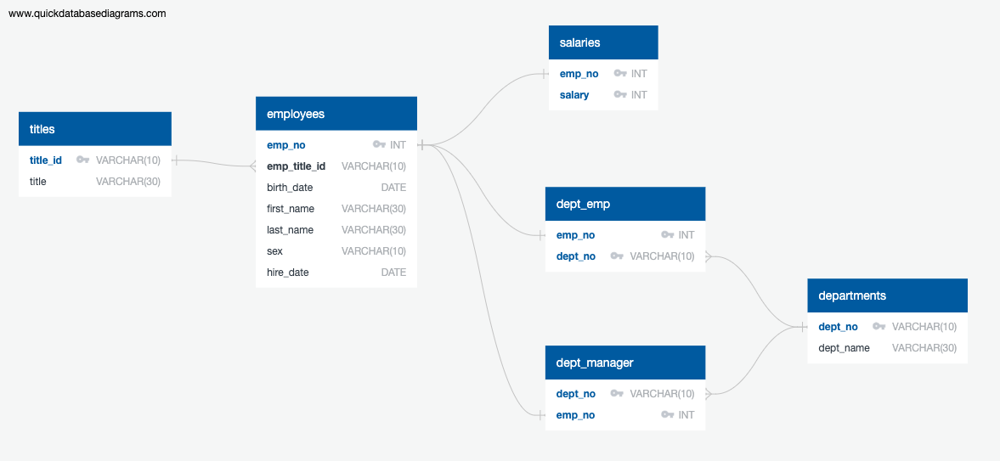
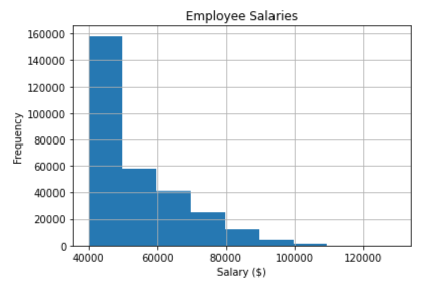
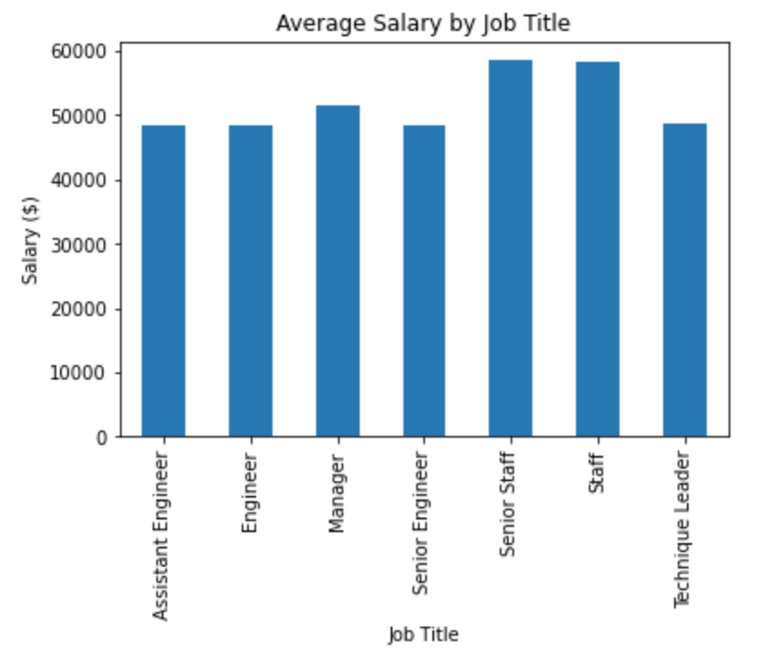

# SQL Challenge - Employee Database: A Mystery in Two Parts

## Task

#### Background Context

It is two weeks since being hired as a new data engineer at Pewlett Hackard. The first major task to complete is a research project on employees of the corporation from the 1980s and 1990s. All that remain of the database of employees from that period are six CSV files.

#### The Assignment
To design tables to hold the data from the CSVs, import the CSVs into a SQL database, and answer questions about the data.

## Tools and Technologies

- Jupyter Notebook
- Pandas
- Python
- SQL
- PostgreSQL

## Data Engineering

* Used the information available to create a table schema for each of the six CSV files. Specified data types, primary keys, foreign keys, and other constraints.

  * Assigned primary keys if the column was unique, otherwise created composite keys, taking two primary keys in order to uniquely identify a row.
  * Ensured tables were created in the correct order to handle foreign keys.

* Imported each CSV file into the corresponding SQL table. Ensured the data was imported in the same order that the tables were created and the headers were accounted for when importing to avoid errors.

## Entity Relationship Diagram

## Data Analysis

Completed an analydid by addressing the following:

1. List the following details of each employee: employee number, last name, first name, sex, and salary.

2. List first name, last name, and hire date for employees who were hired in 1986.

3. List the manager of each department with the following information: department number, department name, the manager's employee number, last name, first name.

4. List the department of each employee with the following information: employee number, last name, first name, and department name.

5. List first name, last name, and sex for employees whose first name is "Hercules" and last names begin with "B."

6. List all employees in the Sales department, including their employee number, last name, first name, and department name.

7. List all employees in the Sales and Development departments, including their employee number, last name, first name, and department name.

8. In descending order, list the frequency count of employee last names, i.e., how many employees share each last name.

## Bonus Analysis

From examining the data, there is a suspicion the dataset is fake. It is surmised that the boss has handed out spurious data in order to test the data engineering skills of a new employee. To confirm this hunch, the following steps are taken to generate a visualisation of the data, which will be presented to the boss:

1. Imported the SQL database into Pandas. 

2. Created a histogram to visualise the most common salary ranges for employees.

The histogram shows that the frequency of salaries is positively skewed, with the data clustered toward the left and tailing off to the right. This graph does not give an indication as to whether the data is manufactured or not. It is feasible that a company could have many of their workers on a base salary, with those receiving higher salaries at a much lower frequency. This frequency would decrease as the salary increased. The salaries would then need to be considered in terms of job title, as the explanation for this graph indicates that those in experienced or senior roles would receive the highest salaries.

3. Created a bar chart of average salary by title.

The bar chart shows that Senior Staff and Staff have the highest average salary, followed by Manager. Assistant Engineer, Engineer, Senior Engineer and Technique Leader then appear to have roughly the same average salary. The bar chart supports the suspicion that the data set is fake and not representative of the company. One particular feature which supports this idea is the similar average salary for those with the position of Assistant Engineer, Engineer and Senior Engineer. It would be expected that the salaries for these positions would differ in a way that reflects the job titles. Of the three, the Senior Engineer title would be expected to have the highest salary, followed by Engineer and then Assistant Engineer

